<div align="center">
    <div>
        
    </div>
    <div>
            <h3><b>PayBaba</b></h3>
            <p><i>AI-Based Credit Scoring & Merchant Growth Intelligence System for MSMEs based on Payment Gateway Data</i></p>
    </div>
</div>
<br>
<h1 align="center">Mini Hackathon Paylabs x Alibaba x BINUS University
<br>
Culminating Event</h1>
<div align="center">

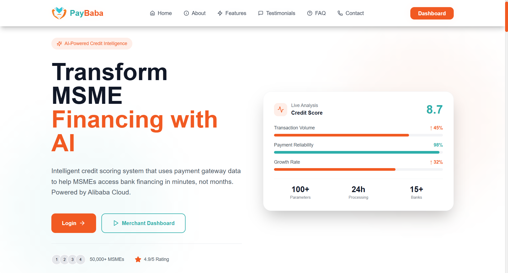

</div>
<br>

PayBaba is a transaction intelligence-based dashboard that utilizes transaction data from payment gateways as the primary source of information to generate structured and credible business performance indicators.

PayBaba is not designed as a lending system, but rather as a decision-support system that assists financial institutions in conducting additional analysis of MSME business feasibility. This system processes digital transaction data, such as sales volume, transaction frequency, cash flow stability, and business growth trends, into quantitative metrics that can be used as supporting evidence in the credit evaluation process. This way, real economic data previously scattered throughout daily transaction activity can be transformed into more structured and easily understood information.

Pitch Deck: 
[https://bit.ly/PayBaba-PitchDeck ](https://bit.ly/PayBaba-PitchDeck )

--- 

## ⚙️ Technology Stack: Frontend

<div align="center">

<kbd></kbd>
<kbd></kbd>
<kbd></kbd>
<kbd></kbd>
<kbd></kbd>

</div>

<div align="center">
<h4>React | Vite | TypeScript | TailwindCSS | ShadcnUI</h4>
</div>

GitHub for Backend: https://github.com/lutfialvarop/PayBaba-API

---

## 🧩 Core Features

### 📊 Features for UMKM
- Credit Readiness Dashboard
- AI Credit Explanation
- Smart Loan Timing
- Business Performance Analytics

🔍 *Get loans without collateral or financial reports*

---

### 💼 Features for Bank
- Merchant Portfolio Dashboard Monitoring
- Credit Analysis Tools
- Early Warning System

🐦‍🔥 *Access verified SME data with AI risk assessment*

---

### 💸 Features for Payment Gateway (PayLabs)
- Monetization Dashboard
- AI Ops Monitoring Dashboard

💰 *Increase merchant stickiness through value-added services*

---

## 🚀 Live Demo

👉 [https://paybaba.vercel.app/](https://paybaba.vercel.app/)

---

## 🧰 Getting Started Locally

### Prerequisites
- **Node.js** (v16+)
- **Git**

### Clone the Project
```bash
git clone https://github.com/StyNW7/PayBaba-AI-Hackathon.git
cd PayBaba-AI-Hackathon
cd frontend
npm install
npm run dev
```

---

## 📸 &nbsp;Result Preview
<table style="width:100%; text-align:center">
    <col width="100%">
    <tr>
        <td width="1%" align="center"></td>
    </tr>
    <tr>
        <td width="1%" align="center">Login Page</td>
    </tr>
    <tr>
        <td width="1%" align="center"></td>
    </tr>
    <tr>
        <td width="1%" align="center">Merchant Dashboard</td>
    </tr>
    <tr>
        <td width="1%" align="center">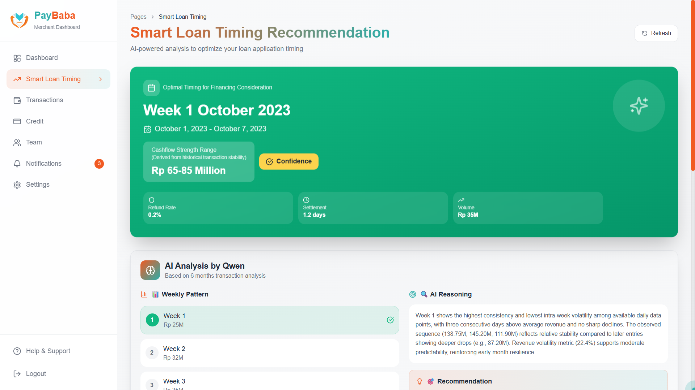</td>
    </tr>
    <tr>
        <td width="1%" align="center">Website - Audio Detail Logs</td>
    </tr>
    <tr>
        <td width="1%" align="center">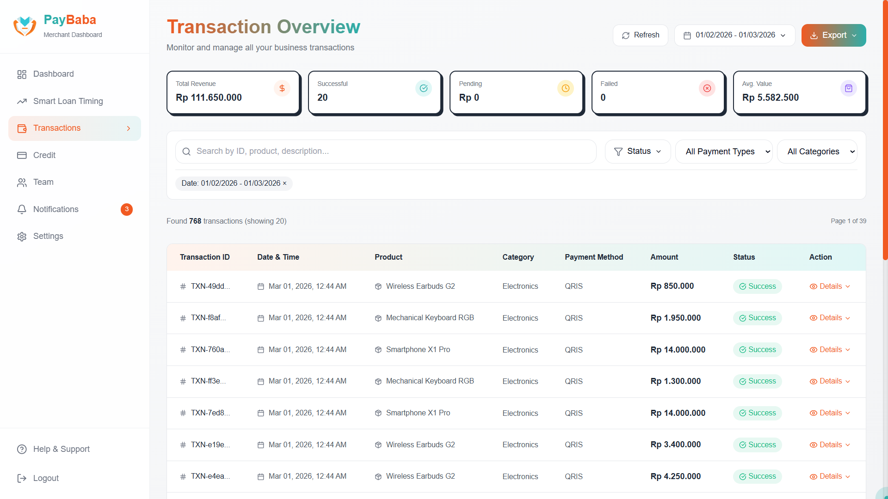</td>
    </tr>
    <tr>
        <td width="1%" align="center">Merchant Transactions Page</td>
    </tr>
    <tr>
        <td width="1%" align="center">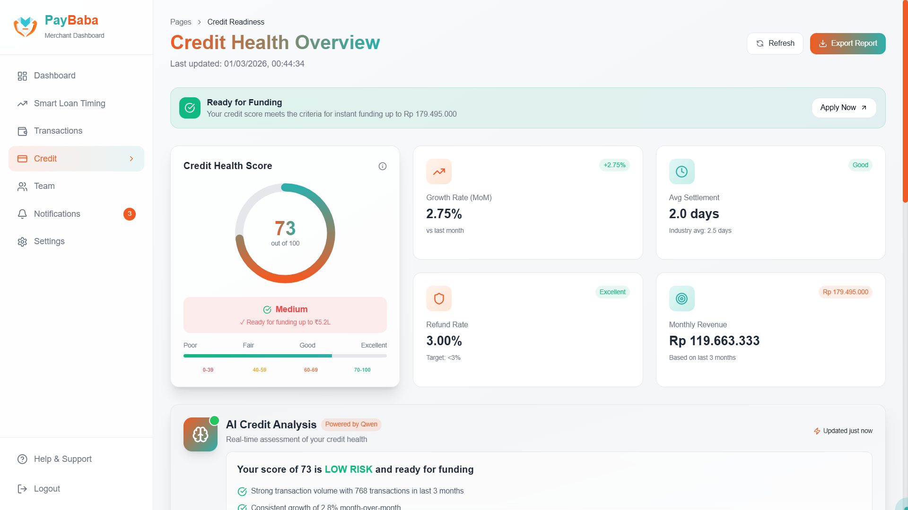</td>
    </tr>
    <tr>
        <td width="1%" align="center">Merchant Credit Details Page</td>
    </tr>
    <tr>
        <td width="1%" align="center">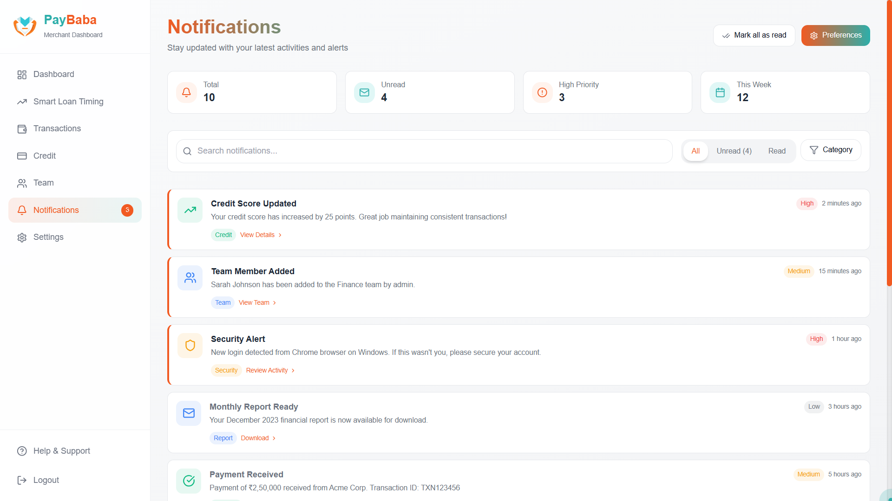</td>
    </tr>
    <tr>
        <td width="1%" align="center">Merchant Notifications Page</td>
    </tr>
    <tr>
        <td width="1%" align="center">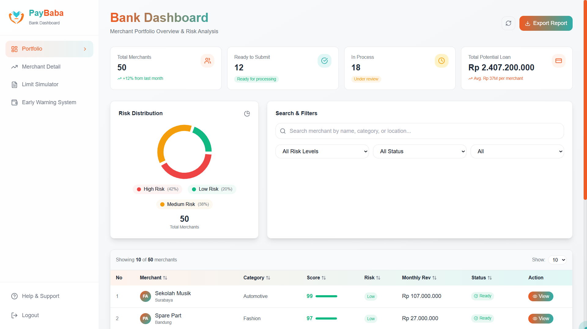</td>
    </tr>
    <tr>
        <td width="1%" align="center">Bank Dashboard Page</td>
    </tr>
    <tr>
        <td width="1%" align="center">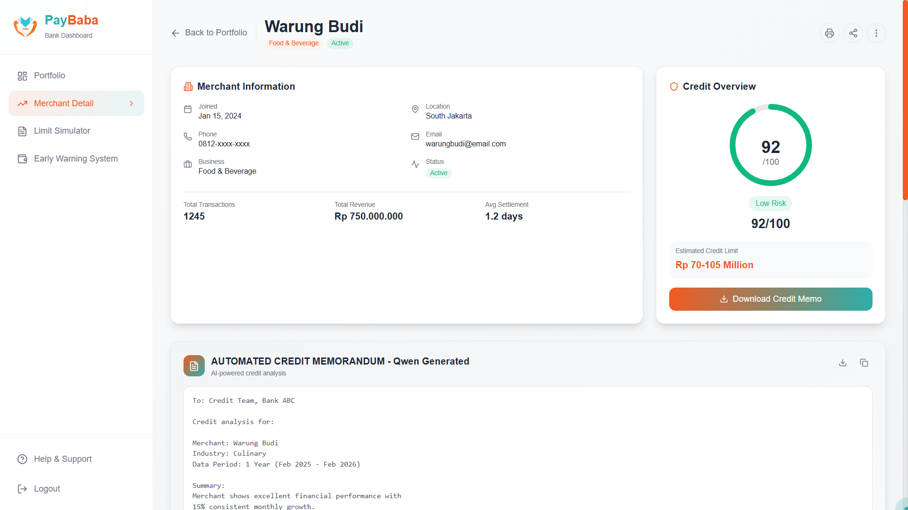</td>
    </tr>
    <tr>
        <td width="1%" align="center">Merchant Details Page</td>
    </tr>
    <tr>
        <td width="1%" align="center">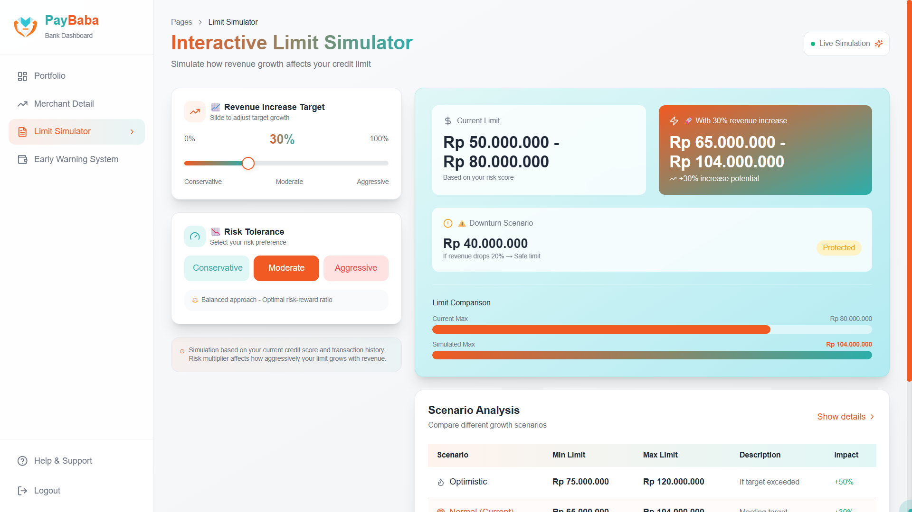</td>
    </tr>
    <tr>
        <td width="1%" align="center">Bank Limit Simulator Page</td>
    </tr>
    <tr>
        <td width="1%" align="center">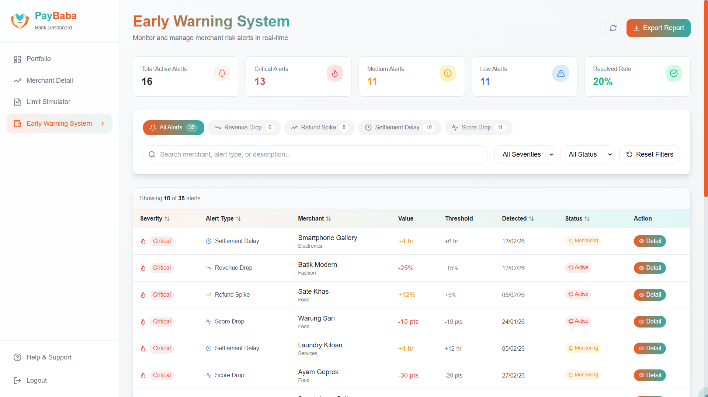</td>
    </tr>
    <tr>
        <td width="1%" align="center">Bank Early Warning System Page</td>
    </tr>
    <tr>
        <td width="1%" align="center">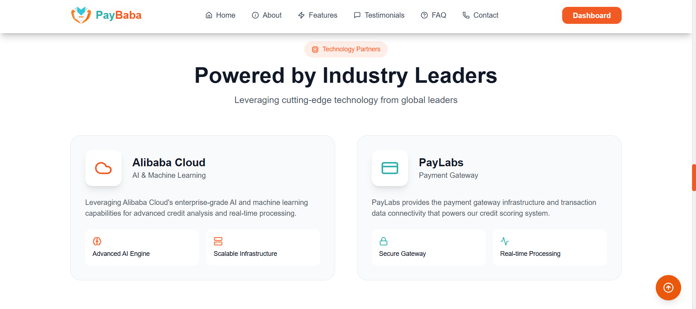</td>
    </tr>
    <tr>
        <td width="1%" align="center">Partners Section</td>
    </tr>
</table>

---

## 🧭 Diagram

*Overall End-to-end System Workflow of PayBaba Project*
<p align="center">
  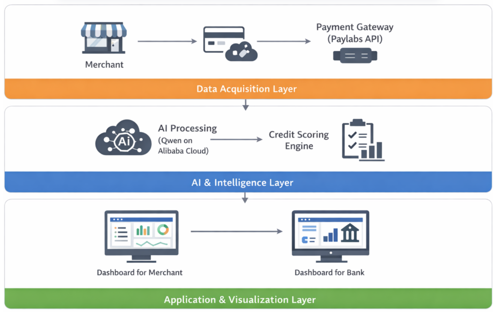
</p>

This diagram illustrates the System Architecture of PayBaba

---

## 👥 Owner

This Repository is created by MU Sang King Team for Mini AI Hackthon by PayLabs x Alibaba Cloud Indonesia x BINUS University:
<ul>
<li>Stanley Nathanael Wijaya - 2702217125</li>
<li>Maulana Hanif Al Faqih Rojichan - 2802487844</li>
<li>Lutfi Alvaro Pratama - 2802428274</li>
<li>Louis Oktovianus - 2702752173</li>
</ul>

---

## 📬 Contact
Have questions or want to collaborate?

- 📧 Email: stanley.n.wijaya7@gmail.com
- 💬 Discord: `stynw7`

<code>Made with ❤️ by MU Sang King</code>